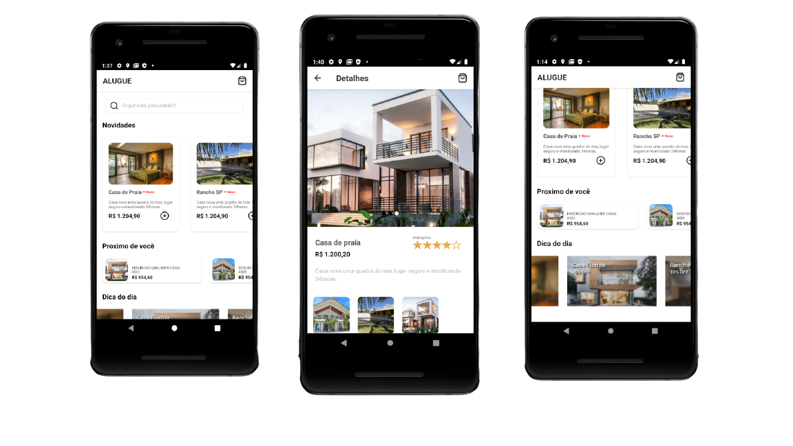

<h1 align="center">
    
    <br>App alugue frontend<br/>
    React Native
</h1> 

<p align="center">
  <a href="#bookmark-sobre">Sobre</a>&nbsp;&nbsp;&nbsp;|&nbsp;&nbsp;&nbsp;
  <a href="#rocket-tecnologias">Tecnologias</a>&nbsp;&nbsp;&nbsp;|&nbsp;&nbsp;&nbsp;
  <a href="#boom-como-executar">Como Executar</a>&nbsp;&nbsp;&nbsp;|&nbsp;&nbsp;&nbsp;
</p>

## :bookmark: Sobre

O **Projeto** foi feito para treinar habilidades front-end com a biblioteca **React Native**.
  


## :rocket: Tecnologias
-  [React Native](http://facebook.github.io/react-native/)

## :boom: Como Executar

- ### **Pré-requisitos**

  - É **necessário** possuir o **[Git](https://git-scm.com/)** instalado e configurado no computador
  - Também, é **preciso** ter um gerenciador de pacotes seja o **[NPM](https://www.npmjs.com/)** ou **[Yarn](https://yarnpkg.com/)**.

1. Faça um clone do repositório:

```sh
  $ git clone https://github.com/matheuspdias/alugue.git
```

2. Executando a Aplicação:

```sh

  # Aplicação mobile
  $ cd alugue
  $ cd alugueapp
  # Instalando as dependências do projeto.
  $ yarn ou npm install
  # Inicie a aplicação mobile
  $ npx react-native run-android
```
